# EasyFood

Осталось реализовать поиск блюд по названию

Приложение содержит 3 activity: MainActivity, MealActivity и CategoryMealsActivity. 

MainActivity содержит в себе 3 фрагмента: Home, Favorites и Categories.

Во фрагменте Home верхний ImageView отображает рандомно выбранное блюдо. ImageView обновляется каждый раз при переходе в другие фрагменты или активности.

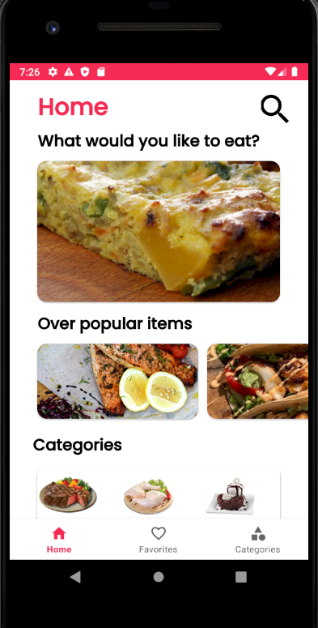

MealActivity отображает подробную информацию о блюде. К этой активности переходим, когда нажимаем на какое-либо блюдо в любых других фрагментах или активностях. Снизу - иконка перехода на видео-инструкцию на youtube. Есть возможность добавить блюдо в избранное.

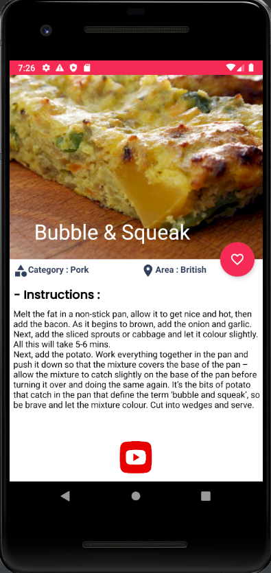

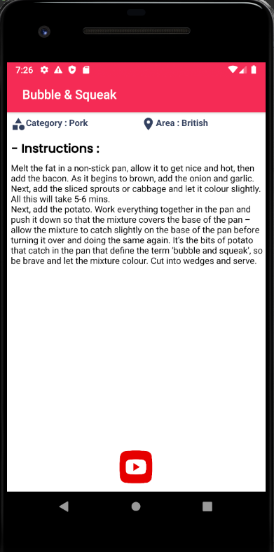

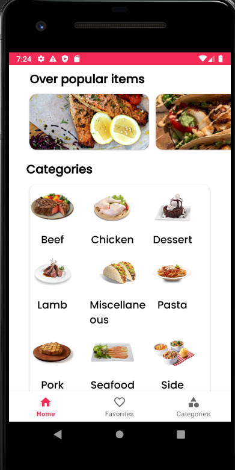

Фрагмент Favorites отображает список избранных блюд. Свайпом направо или налево можно удалить блюдо. Также можно отменить удаление.

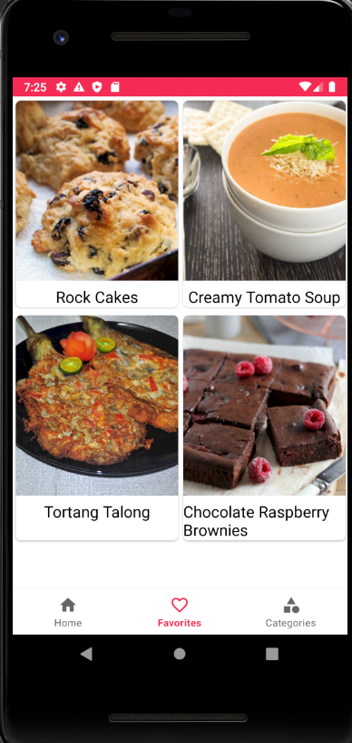

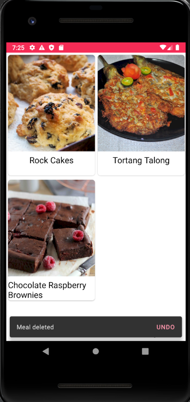

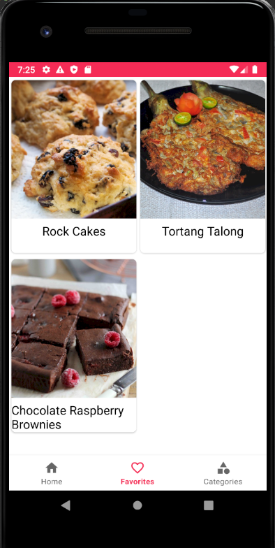

Фрагмент Categories отображает список категорий блюд.

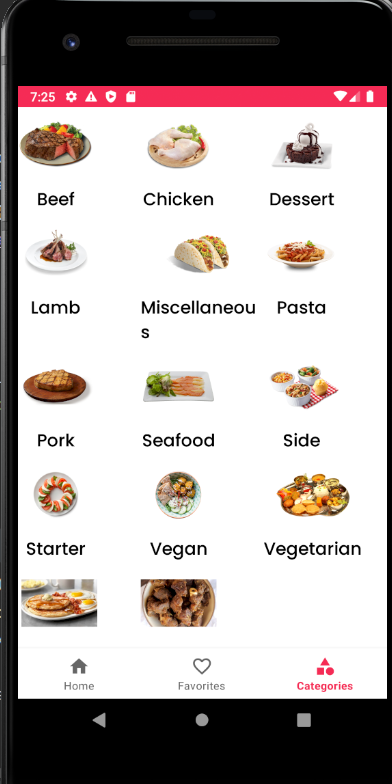

 При выборе определенной категории переходим в CategoryMealsActivity со списком блюд. Число сверху означает количество блюд в категории.

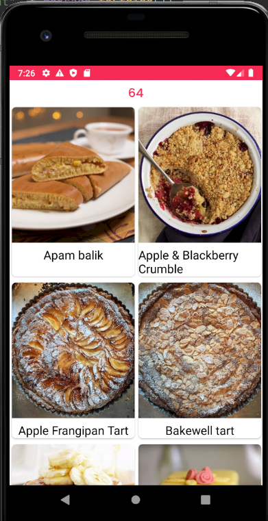

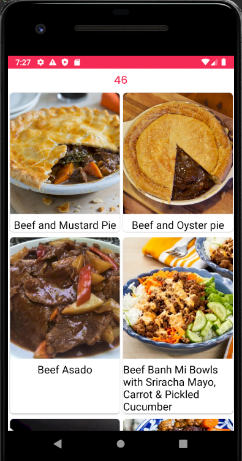

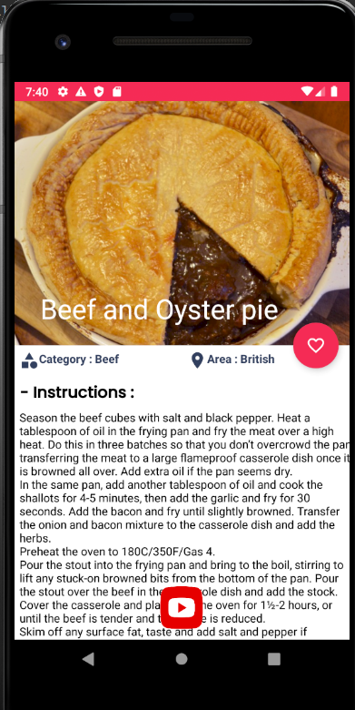
